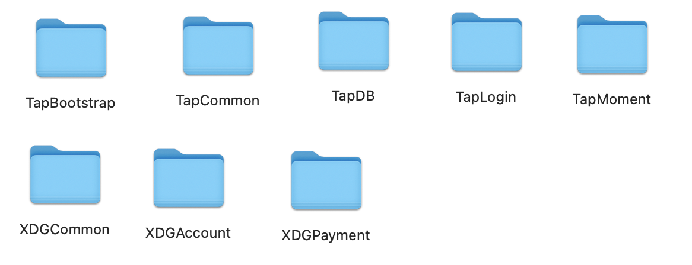
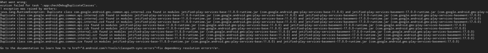
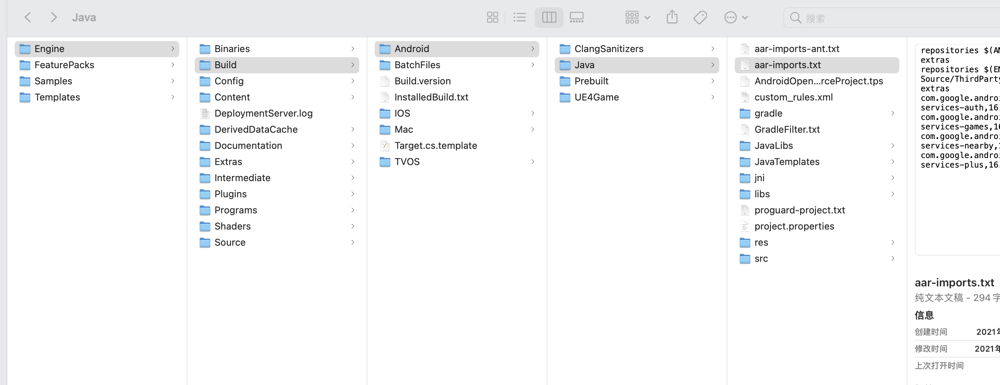
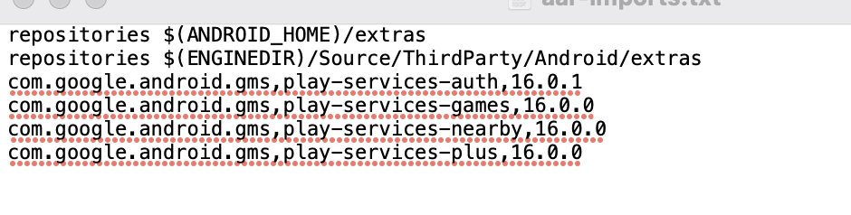

## XDGSDK-UE4配置

#### 1.添加Plugins文件夹里的插件



#### 2.配置
把 `XDGCommon/Source/XDGCommon/Configs` 文件夹里的 `XDConfig.json`配置成游戏的参数 [参数说明文档](https://docs.xdglobalapi.com/docs/guide/guide_get_started)

把 `XDGCommon/Source/XDGCommon` 文件夹里的 `XDGCommon_iOS_UPL.xml` 和 `XDGCommon_Android_UPL.xml` 值配置成自己的参数

把 `XDGCommon/Source/XDGCommon/Android/googleJson/google-services.json` 和 `XDGCommon/Source/XDGCommon/iOS/GoogleService-Info.plist`替换成游戏自己的文件，这两个文件是游戏从[Firebase后台](https://console.firebase.google.com/)下载的，如果不使用Firebase，则可以删除这两个文件


#### 3.如果接入的时候有报谷歌gms包冲突的话，可以修改 `Engine/Build/Android/Java/aar-imports.txt`中对应的gms版本号。





## XDGCommon 使用

#### 接口在 `XDGCommonBPLibrary.h`中，回调在 `XDGCommon.h`中

```
//初始化SDK
UFUNCTION(BlueprintCallable, Category = "XDGCommon")
static void InitSDK();

//初始化回调
//success: true成功， false失败
UPROPERTY(BlueprintAssignable, Category = "XDGCommon")
static FXDGSDKInitCompleted OnXDGSDKInitCompleted;

// 设置语言，参数如下
// 0 简体中文
// 1 繁体中文
// 2 英文
// 3 泰文
// 4 印尼文
// 5 韩文
// 6 日文
// 7 德语
// 8 法语
// 9 葡萄牙语
// 10 西班牙语
// 11 土耳其语
// 12 俄语
// 13 越南语
UFUNCTION(BlueprintCallable, Category = "XDGCommon")
static void SetLanguage(int32 langType);

//TapDB 统计用户，登录成功后使用
UFUNCTION(BlueprintCallable, Category = "XDGCommon")
static void TrackUser(FString userId);

//获取版本号
UFUNCTION(BlueprintCallable, Category = "XDGCommon")
static FString GetSDKVersionName();

//是否初始化
UFUNCTION(BlueprintCallable, Category = "XDGCommon")
static bool IsInitialized();

//打开评分
UFUNCTION(BlueprintCallable, Category = "XDGCommon")
static void StoreReview();

//上报游戏信息
UFUNCTION(BlueprintCallable, Category = "XDGCommon")
static void Report(FString serverId, FString roleId, FString roleName);

//自定义事件埋点
UFUNCTION(BlueprintCallable, Category = "XDGCommon")
static void TrackEvent(FString eventName);

//获取位置信息
UFUNCTION(BlueprintCallable, Category = "XDGCommon")
static void GetRegionInfo();

//获取位置信息回调
//countryCode, city, timeZone, locationInfoType
UPROPERTY(BlueprintAssignable, Category = "XDGCommon")
static FXDGSDKGetRegionInfoCompleted OnXDGSDKGetRegionInfoCompleted;
```

## XDGAccount 使用

#### 接口在`XDGAccountBPLibrary.h`中，回调在`XDGAccount.h`中

```
//单独调用第三方登录 
// "DEFAULT"  以上次登录成功的信息自动登录
// "TAPTAP"
// "GOOGLE"
// "FACEBOOK"
// "APPLE"
// "LINE"
// "TWITTER"
// "GUEST" 游客登录
UFUNCTION(BlueprintCallable, Category = "XDGAccount")
static void LoginByType(FString loginType);

//SDK自带弹框弹框登录(不推荐)，参数是弹框里的登录类型
UFUNCTION(BlueprintCallable, Category = "XDGAccount")
static void Login(TArray<FString> loginTypes);

//登录回调   
UPROPERTY(BlueprintAssignable, Category = "XDGAccount")
static FXDGSDKLoginSucceed OnXDGSDKLoginSucceed;
UPROPERTY(BlueprintAssignable, Category = "XDGAccount")
static FXDGSDKLoginFailed OnXDGSDKLoginFailed;

//绑定状态回调
LOGOUT = 0x9001, 登出
BIND = 0x1001,  绑定
UNBIND = 0x1002,解绑
UFUNCTION(BlueprintCallable, Category = "XDGAccount")
static void AddUserStatusChangeCallback();

UPROPERTY(BlueprintAssignable, Category = "XDGAccount")
static FXDGSDKUserStateChanged OnXDGSDKUserStateChanged;

//获取用户
UFUNCTION(BlueprintCallable, Category = "XDGAccount")
static void GetUser();

UPROPERTY(BlueprintAssignable, Category = "XDGAccount")
static FXDGSDKGetUserSucceed OnXDGSDKGetUserSucceed;
UPROPERTY(BlueprintAssignable, Category = "XDGAccount")
static FXDGSDKGetUserFailed OnXDGSDKGetUserFailed;

//打开用户中心
UFUNCTION(BlueprintCallable, Category = "XDGAccount")
static void OpenUserCenter();

//退出
UFUNCTION(BlueprintCallable, Category = "XDGAccount")
static void Logout();

//获取sessionToken
UFUNCTION(BlueprintCallable, Category = "XDGAccount")
static void LoginSync();

//打开注销账号页面
UFUNCTION(BlueprintCallable, Category = "XDGAccount")
static void OpenAccountCancellation();

//token是否可用 true false
// "TAPTAP"
// "GOOGLE"
// "FACEBOOK"
// "APPLE"
// "LINE"
// "TWITTER"
// "GUEST"
UFUNCTION(BlueprintCallable, Category = "XDGAccount")
static bool IsTokenActiveWithType(FString loginType);   

//绑定第三方接口 true false
// "TAPTAP"
// "GOOGLE"
// "FACEBOOK"
// "APPLE"
// "LINE"
// "TWITTER"
UFUNCTION(BlueprintCallable, Category = "XDGAccount")
static void BindByType(FString loginType);    

UPROPERTY(BlueprintAssignable, Category = "XDGAccount")
static FXDGSDKBindByTypeCompleted OnXDGSDKBindByTypeCompleted;

```

## XDGPayment 使用
### 支付模块需要区分平台分别接入！

接口在`XDGPaymentBPLibrary.h`中，回调在`XDGPayment.h`中

```
//苹果支付 或 谷歌支付 （苹果支付推荐使用）
UFUNCTION(BlueprintCallable, Category = "XDGPayment") 
static void PayWithProduct(FString orderId,
                            FString productId,
                            FString roleId,
                            FString serverId,
                            FString ext);
UPROPERTY(BlueprintAssignable, Category = "XDGPayment")
static FXDGSDKPaymentSucceed OnXDGSDKPaymentSucceed;
UPROPERTY(BlueprintAssignable, Category = "XDGPayment")
static FXDGSDKPaymentFailed OnXDGSDKPaymentFailed;

//安卓网页支付（安卓支付这个推荐使用）安卓网页支付，iOS没有
UFUNCTION(BlueprintCallable, Category = "XDGPayment") 
static void PayWithWeb(
                         FString orderId,
                        FString productId, 
                        FString productName,
                        float  payAmount,
                        FString roleId,
                        FString serverId,        
                        FString extras);
//code: 0完成 1取消 2处理中 其他失败
UPROPERTY(BlueprintAssignable, Category = "XDGPayment")
static FXDGSDKPayWithWebCompleted OnXDGSDKPayWithWebCompleted;
                        

//检查补款信息(无弹框)
UFUNCTION(BlueprintCallable, Category = "XDGPayment")
static void CheckRefundStatus();
UPROPERTY(BlueprintAssignable, Category = "XDGPayment")
static FXDGSDKCheckRefundStatusSucceed OnXDGSDKCheckRefundStatusSucceed;
UPROPERTY(BlueprintAssignable, Category = "XDGPayment")
static FXDGSDKCheckRefundStatusFailed OnXDGSDKCheckRefundStatusFailed;

//检查补款信息(SDK自带弹框，弹框消失不掉，会卡游戏使用流程)
UFUNCTION(BlueprintCallable, Category = "XDGPayment")
static void CheckRefundStatusWithUI();
UPROPERTY(BlueprintAssignable, Category = "XDGPayment")
static FXDGSDKCheckRefundStatusSucceed OnXDGSDKCheckRefundStatusSucceed;
UPROPERTY(BlueprintAssignable, Category = "XDGPayment")
static FXDGSDKCheckRefundStatusFailed OnXDGSDKCheckRefundStatusFailed;
                            
//查询苹果或谷歌商品信息 iOS苹果支付商品信息 和 安卓谷歌商品信息
UFUNCTION(BlueprintCallable, Category = "XDGPayment")
static void QueryWithProductIdArray(TArray<FString> productIds); 
UPROPERTY(BlueprintAssignable, Category = "XDGPayment")
static FXDGSDKQueryRestoredPurchasesSucceed OnXDGSDKQueryRestoredPurchasesSucceed;
UPROPERTY(BlueprintAssignable, Category = "XDGPayment")
static FXDGSDKQueryRestoredPurchasesFailed OnXDGSDKQueryRestoredPurchasesFailed;
```

